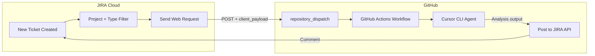

# JIRA-to-Cursor Analysis Pipeline

When a new JIRA ticket is created (in a specific project and issue type), this pipeline triggers a GitHub Actions workflow that runs Cursor CLI with the sunspectra-ecommerce-analyst skill to perform data-driven analysis, then posts the results back to the JIRA ticket as a comment.

## Overview

1. **Trigger:** A new JIRA ticket is created in the configured project with the configured issue type.
2. **Analysis:** JIRA Automation sends a webhook to GitHub, which runs a workflow. The workflow invokes Cursor CLI with the sunspectra-ecommerce-analyst skill to analyze the ticket using Snowflake data (via Solid MCP text2SQL and `scripts/query_snowflake.py`).
3. **Post-back:** The analysis output is posted as a comment on the original JIRA ticket.

## How It Works



**Step-by-step flow:**

1. JIRA Automation fires when an issue is created (filtered by project and issue type).
2. JIRA sends a POST request to GitHub's `repository_dispatch` API with the ticket key, summary, and description.
3. GitHub Actions runs the workflow: checkout, Python setup, Cursor CLI install, agent run.
4. Cursor CLI executes the sunspectra-ecommerce-analyst skill (text2SQL → Snowflake → analysis).
5. `scripts/post_to_jira.py` posts the analysis output as a comment on the JIRA ticket.

## Prerequisites

- **JIRA Cloud** project with Automation enabled
- **GitHub** repository with Actions enabled
- **Cursor** account (for `CURSOR_API_KEY`)
- **Snowflake** access (for the analysis queries)
- **Solid MCP** (for text2SQL in the skill; see [MCP and Skill in CI](#mcp-and-skill-in-ci))

## Deployment

### 1. GitHub Secrets

Add these secrets in **Settings → Secrets and variables → Actions**:

| Secret | Description |
|--------|-------------|
| `SNOWFLAKE_ACCOUNT` | Snowflake account identifier (e.g. `xy12345.us-east-1`) |
| `SNOWFLAKE_USER` | Snowflake username |
| `SNOWFLAKE_PASSWORD` | Snowflake password |
| `SNOWFLAKE_WAREHOUSE` | Snowflake warehouse name |
| `SNOWFLAKE_DATABASE` | Snowflake database (e.g. `SUN_SPECTRA`) |
| `SNOWFLAKE_SCHEMA` | (Optional) Snowflake schema |
| `CURSOR_API_KEY` | Cursor API key from your Cursor account |
| `JIRA_BASE_URL` | JIRA Cloud base URL (e.g. `https://your-domain.atlassian.net`) |
| `JIRA_EMAIL` | Atlassian account email |
| `JIRA_API_TOKEN` | JIRA API token from [id.atlassian.com](https://id.atlassian.com/manage-profile/security/api-tokens) |

### 2. JIRA Automation Rule

1. Go to **Project settings → Automation**.
2. Create a new rule.
3. **Trigger:** Issue created
4. **Conditions:**
   - Project equals `[YOUR_PROJECT_KEY]`
   - Issue type equals `[YOUR_ISSUE_TYPE]` (e.g. "Analysis Request" or "Story")
5. **Action:** Send web request
   - **URL:** `https://api.github.com/repos/OWNER/REPO/dispatches` (replace `OWNER` and `REPO` with your GitHub org/repo)
   - **Method:** POST
   - **Headers:**
     - `Accept`: `application/vnd.github.v3+json`
     - `Authorization`: `Bearer {{your_github_pat}}` (store the PAT as a JIRA secret/variable)
   - **Body (JSON):**

```json
{
  "event_type": "jira_analysis_request",
  "client_payload": {
    "issue_key": "{{issue.key}}",
    "summary": "{{issue.fields.summary}}",
    "description": "{{issue.fields.description}}"
  }
}
```

Create a GitHub Personal Access Token with `repo` scope and store it securely in JIRA Automation (e.g. as a secret or variable).

### 3. Verification

1. Create a test ticket in the configured JIRA project with the configured issue type.
2. In GitHub, go to **Actions** and confirm the workflow run started.
3. When the run completes, check the JIRA ticket for a new comment with the analysis.

## Configuration

- **Project and issue type:** Edit the JIRA Automation rule conditions to change which tickets trigger the pipeline.
- **GitHub repo URL:** Update the webhook URL in the JIRA "Send web request" action if you move or rename the repo.
- **Timeout:** The workflow uses a timeout on the Cursor step to avoid indefinite hangs; adjust in `.github/workflows/jira-analysis.yml` if needed.

## Troubleshooting

### Workflow doesn't trigger

- Confirm the JIRA Automation rule is enabled and the conditions match your test ticket.
- Verify the webhook URL is correct (`https://api.github.com/repos/OWNER/REPO/dispatches`).
- Ensure the GitHub PAT has `repo` scope and is valid.
- Check JIRA Automation execution history for errors.

### Cursor hangs or times out

- Some users report `agent -p` hanging in CI. The workflow includes a timeout; increase it if analyses are long.
- Verify MCP (Solid text2SQL) is available in headless mode; see [MCP and Skill in CI](#mcp-and-skill-in-ci).

### JIRA comment fails

- Confirm `JIRA_BASE_URL`, `JIRA_EMAIL`, and `JIRA_API_TOKEN` are set correctly in GitHub Secrets.
- Ensure the JIRA user has permission to add comments to the issue.
- Check the workflow logs for the full error (secrets are masked).

### MCP not available in CI

The skill uses `mcp_solid_text2sql`. If MCP does not work in Cursor CLI headless mode:

- Add `.cursor/mcp.json` to the repo if Solid provides a project-level config for CI.
- Verify locally: run `agent -p "Use mcp_solid_text2sql to generate SQL for: What is the open rate by campaign segment for the last 3 months?"` in the project directory.
- If MCP cannot run in CI, consider a Python-only path using Solid's HTTP API (if available) plus `scripts/query_snowflake.py`.

## Local Development

### Run the skill manually

From the project root:

```bash
agent -p "Use the sunspectra-ecommerce-analyst skill to analyze: What is the open rate by campaign segment for the last 3 months?"
```

Ensure `.env` is configured with Snowflake credentials and Cursor CLI is installed.

### Test post_to_jira.py locally

```bash
# From stdin
echo "Test analysis output" | python scripts/post_to_jira.py --issue-key PROJECT-123

# Or with --body
python scripts/post_to_jira.py --issue-key PROJECT-123 --body "Test analysis output"
```

Set `JIRA_BASE_URL`, `JIRA_EMAIL`, and `JIRA_API_TOKEN` in `.env` or the environment.
